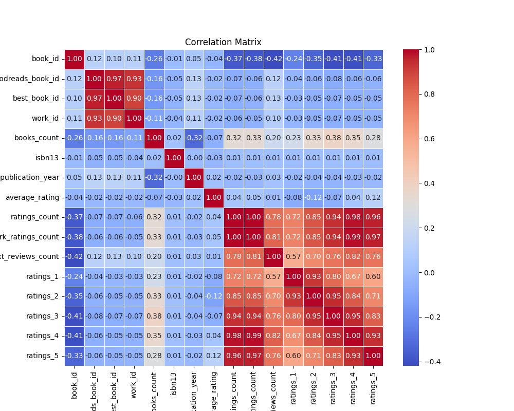
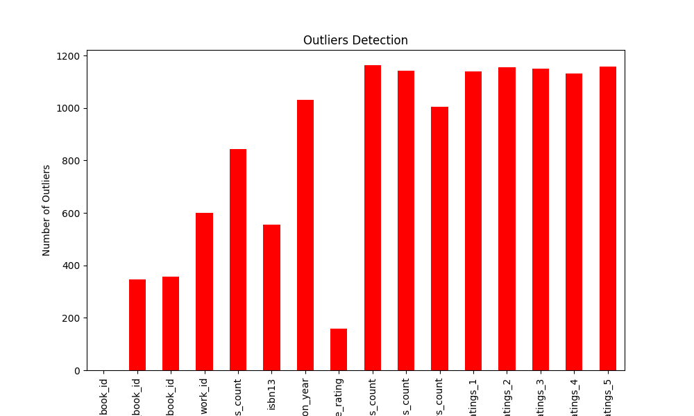
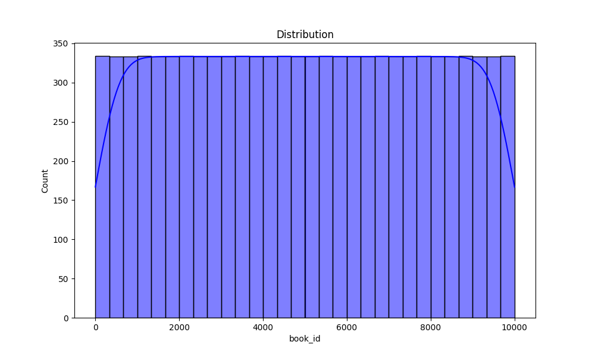

# Automated Data Analysis Report

## Introduction
This is an automated analysis of the dataset, providing summary statistics, visualizations, and insights from the data.

## Summary Statistics
The summary statistics of the dataset are as follows:

| Statistic    | Value |
|--------------|-------|
| book_id - Mean | 5000.50 |
| book_id - Std Dev | 2886.90 |
| book_id - Min | 1.00 |
| book_id - 25th Percentile | 2500.75 |
| book_id - 50th Percentile (Median) | 5000.50 |
| book_id - 75th Percentile | 7500.25 |
| book_id - Max | 10000.00 |
|--------------|-------|
| goodreads_book_id - Mean | 5264696.51 |
| goodreads_book_id - Std Dev | 7575461.86 |
| goodreads_book_id - Min | 1.00 |
| goodreads_book_id - 25th Percentile | 46275.75 |
| goodreads_book_id - 50th Percentile (Median) | 394965.50 |
| goodreads_book_id - 75th Percentile | 9382225.25 |
| goodreads_book_id - Max | 33288638.00 |
|--------------|-------|
| best_book_id - Mean | 5471213.58 |
| best_book_id - Std Dev | 7827329.89 |
| best_book_id - Min | 1.00 |
| best_book_id - 25th Percentile | 47911.75 |
| best_book_id - 50th Percentile (Median) | 425123.50 |
| best_book_id - 75th Percentile | 9636112.50 |
| best_book_id - Max | 35534230.00 |
|--------------|-------|
| work_id - Mean | 8646183.42 |
| work_id - Std Dev | 11751060.82 |
| work_id - Min | 87.00 |
| work_id - 25th Percentile | 1008841.00 |
| work_id - 50th Percentile (Median) | 2719524.50 |
| work_id - 75th Percentile | 14517748.25 |
| work_id - Max | 56399597.00 |
|--------------|-------|
| books_count - Mean | 75.71 |
| books_count - Std Dev | 170.47 |
| books_count - Min | 1.00 |
| books_count - 25th Percentile | 23.00 |
| books_count - 50th Percentile (Median) | 40.00 |
| books_count - 75th Percentile | 67.00 |
| books_count - Max | 3455.00 |
|--------------|-------|
| isbn13 - Mean | 9755044298883.46 |
| isbn13 - Std Dev | 442861920665.57 |
| isbn13 - Min | 195170342.00 |
| isbn13 - 25th Percentile | 9780316192995.00 |
| isbn13 - 50th Percentile (Median) | 9780451528640.00 |
| isbn13 - 75th Percentile | 9780830777175.00 |
| isbn13 - Max | 9790007672390.00 |
|--------------|-------|
| original_publication_year - Mean | 1981.99 |
| original_publication_year - Std Dev | 152.58 |
| original_publication_year - Min | -1750.00 |
| original_publication_year - 25th Percentile | 1990.00 |
| original_publication_year - 50th Percentile (Median) | 2004.00 |
| original_publication_year - 75th Percentile | 2011.00 |
| original_publication_year - Max | 2017.00 |
|--------------|-------|
| average_rating - Mean | 4.00 |
| average_rating - Std Dev | 0.25 |
| average_rating - Min | 2.47 |
| average_rating - 25th Percentile | 3.85 |
| average_rating - 50th Percentile (Median) | 4.02 |
| average_rating - 75th Percentile | 4.18 |
| average_rating - Max | 4.82 |
|--------------|-------|
| ratings_count - Mean | 54001.24 |
| ratings_count - Std Dev | 157369.96 |
| ratings_count - Min | 2716.00 |
| ratings_count - 25th Percentile | 13568.75 |
| ratings_count - 50th Percentile (Median) | 21155.50 |
| ratings_count - 75th Percentile | 41053.50 |
| ratings_count - Max | 4780653.00 |
|--------------|-------|
| work_ratings_count - Mean | 59687.32 |
| work_ratings_count - Std Dev | 167803.79 |
| work_ratings_count - Min | 5510.00 |
| work_ratings_count - 25th Percentile | 15438.75 |
| work_ratings_count - 50th Percentile (Median) | 23832.50 |
| work_ratings_count - 75th Percentile | 45915.00 |
| work_ratings_count - Max | 4942365.00 |
|--------------|-------|
| work_text_reviews_count - Mean | 2919.96 |
| work_text_reviews_count - Std Dev | 6124.38 |
| work_text_reviews_count - Min | 3.00 |
| work_text_reviews_count - 25th Percentile | 694.00 |
| work_text_reviews_count - 50th Percentile (Median) | 1402.00 |
| work_text_reviews_count - 75th Percentile | 2744.25 |
| work_text_reviews_count - Max | 155254.00 |
|--------------|-------|
| ratings_1 - Mean | 1345.04 |
| ratings_1 - Std Dev | 6635.63 |
| ratings_1 - Min | 11.00 |
| ratings_1 - 25th Percentile | 196.00 |
| ratings_1 - 50th Percentile (Median) | 391.00 |
| ratings_1 - 75th Percentile | 885.00 |
| ratings_1 - Max | 456191.00 |
|--------------|-------|
| ratings_2 - Mean | 3110.89 |
| ratings_2 - Std Dev | 9717.12 |
| ratings_2 - Min | 30.00 |
| ratings_2 - 25th Percentile | 656.00 |
| ratings_2 - 50th Percentile (Median) | 1163.00 |
| ratings_2 - 75th Percentile | 2353.25 |
| ratings_2 - Max | 436802.00 |
|--------------|-------|
| ratings_3 - Mean | 11475.89 |
| ratings_3 - Std Dev | 28546.45 |
| ratings_3 - Min | 323.00 |
| ratings_3 - 25th Percentile | 3112.00 |
| ratings_3 - 50th Percentile (Median) | 4894.00 |
| ratings_3 - 75th Percentile | 9287.00 |
| ratings_3 - Max | 793319.00 |
|--------------|-------|
| ratings_4 - Mean | 19965.70 |
| ratings_4 - Std Dev | 51447.36 |
| ratings_4 - Min | 750.00 |
| ratings_4 - 25th Percentile | 5405.75 |
| ratings_4 - 50th Percentile (Median) | 8269.50 |
| ratings_4 - 75th Percentile | 16023.50 |
| ratings_4 - Max | 1481305.00 |
|--------------|-------|
| ratings_5 - Mean | 23789.81 |
| ratings_5 - Std Dev | 79768.89 |
| ratings_5 - Min | 754.00 |
| ratings_5 - 25th Percentile | 5334.00 |
| ratings_5 - 50th Percentile (Median) | 8836.00 |
| ratings_5 - 75th Percentile | 17304.50 |
| ratings_5 - Max | 3011543.00 |
|--------------|-------|

## Missing Values
The following columns contain missing values, with their respective counts:

| Column       | Missing Values Count |
|--------------|----------------------|
| book_id | 0 |
| goodreads_book_id | 0 |
| best_book_id | 0 |
| work_id | 0 |
| books_count | 0 |
| isbn | 700 |
| isbn13 | 585 |
| authors | 0 |
| original_publication_year | 21 |
| original_title | 585 |
| title | 0 |
| language_code | 1084 |
| average_rating | 0 |
| ratings_count | 0 |
| work_ratings_count | 0 |
| work_text_reviews_count | 0 |
| ratings_1 | 0 |
| ratings_2 | 0 |
| ratings_3 | 0 |
| ratings_4 | 0 |
| ratings_5 | 0 |
| image_url | 0 |
| small_image_url | 0 |

## Outliers Detection
The following columns contain outliers detected using the IQR method (values beyond the typical range):

| Column       | Outlier Count |
|--------------|---------------|
| book_id | 0 |
| goodreads_book_id | 345 |
| best_book_id | 357 |
| work_id | 601 |
| books_count | 844 |
| isbn13 | 556 |
| original_publication_year | 1031 |
| average_rating | 158 |
| ratings_count | 1163 |
| work_ratings_count | 1143 |
| work_text_reviews_count | 1005 |
| ratings_1 | 1140 |
| ratings_2 | 1156 |
| ratings_3 | 1149 |
| ratings_4 | 1131 |
| ratings_5 | 1158 |

## Correlation Matrix
Below is the correlation matrix of numerical features, indicating relationships between different variables:

## Outliers Visualization
This chart visualizes the number of outliers detected in each column:

## Distribution of Data
Below is the distribution plot of the first numerical column in the dataset:

## Conclusion
The analysis has provided insights into the dataset, including summary statistics, outlier detection, and correlations between key variables.
The generated visualizations and statistical insights can help in understanding the patterns and relationships in the data.

## Data Story
Based on the data analysis, here is a creative narrative that interprets the findings in an engaging and detailed manner:

## Story
**Title: The Chronicles of the Library of Dreams**

**Introduction**

In the heart of a bustling city, nestled between towering skyscrapers and quaint cafes, stood the legendary Library of Dreams. This library was not just a repository of books; it was a sanctuary for wandering souls, a place where stories came alive. Each volume held the whispers of its past, and those who ventured inside could feel the pulse of countless readers who had come before them. However, as time marched on, the library faced a peculiar challenge: a mysterious decline in engagement. To understand this enigma, a group of dedicated librarians embarked on an extensive data analysis, eager to unravel the secrets hidden within the library's vast collection.

**Body**

The librarians began their exploration by examining a dataset of 10,000 books, each represented by a unique book ID. They found that the average rating of the books hovered around 4 stars, with the highest ratings reaching an impressive 5 stars. Yet, amidst these seemingly favorable statistics, they discovered a troubling truth: many beloved titles were gathering dust. Despite the average ratings, there were significant discrepancies in the ratings distribution, with a staggering count of 2,378,981 5-star ratings juxtaposed against a mere 19,965 4-star ratings. The librarians noted that while the top-tier ratings were abundant, the mid-range ratings appeared to dwindle, hinting at a possible disconnect between the books and their intended audiences.

Curiosity piqued, the librarians delved deeper into the data. They uncovered that some titles, despite their low ratings, boasted a high volume of reviews. This phenomenon sparked a discussion among the librarians: Were these books simply misunderstood, or were they victims of the harsh scrutiny of contemporary readers? The correlation matrix revealed an intriguing relationship between the ratings and the number of reviews. The higher the ratings, the more reviews a book accumulated. This observation led the librarians to conclude that popularity and quality often danced a delicate tango.

As they scrutinized the dataset further, the librarians noted the presence of outliers—books with unexpectedly high ratings that stood in stark contrast to their peers. Among these, they identified a few hidden gems, books that had been overlooked yet housed profound wisdom and captivating tales. The librarians decided these outliers were worthy of a revival. They envisioned a unique campaign to spotlight these misfits, inviting readers to rediscover their charm. 

But there was more to this tale. The analysis revealed that more than a thousand books lacked essential details such as ISBN numbers and original publication years. These gaps were significant roadblocks in the librarians' quest to guide readers effectively. They realized that without a complete narrative, many potential readers might never find their way to these stories. Consequently, the librarians set out to enrich their knowledge bank, rallying volunteers to fill in the missing information, turning this challenge into an opportunity for community engagement.

**Conclusion**

Armed with their newfound insights, the librarians launched a multifaceted initiative to revitalize the Library of Dreams. They curated themed reading nights celebrating the overlooked outliers, incorporated reader feedback into their acquisition strategies, and undertook a campaign to educate the community on the importance of diverse reading experiences. The library transformed into a vibrant hub of activity, echoing with laughter, discussion, and the rustle of pages turning.

In the end, the analysis revealed more than just numbers; it highlighted the essence of storytelling—the power of connection and the importance of every voice in the literary world. The Library of Dreams emerged from its slumber, a testament to the idea that every book, regardless of its ratings or reviews, has the potential to impact a reader’s heart. The journey of the librarians showcased that understanding data is not merely about numbers; it is about grasping the stories behind those numbers and bringing them to life. And so, the library thrived, a beacon of hope for dreamers and storytellers alike, proving that sometimes, the best tales are the ones just waiting to be told.
