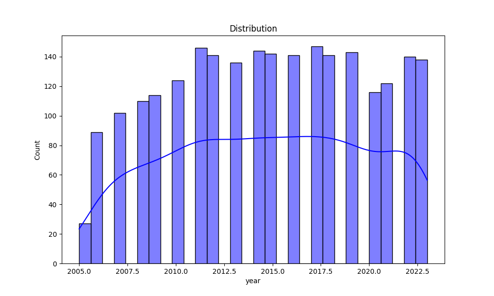

# Automated Data Analysis Report

## Introduction
This is an automated analysis of the dataset, providing summary statistics, visualizations, and insights from the data.

## Summary Statistics
The summary statistics of the dataset are as follows:

| Statistic    | Value |
|--------------|-------|
| year - Mean | 2014.76 |
| year - Std Dev | 5.06 |
| year - Min | 2005.00 |
| year - 25th Percentile | 2011.00 |
| year - 50th Percentile (Median) | 2015.00 |
| year - 75th Percentile | 2019.00 |
| year - Max | 2023.00 |
|--------------|-------|
| Life Ladder - Mean | 5.48 |
| Life Ladder - Std Dev | 1.13 |
| Life Ladder - Min | 1.28 |
| Life Ladder - 25th Percentile | 4.65 |
| Life Ladder - 50th Percentile (Median) | 5.45 |
| Life Ladder - 75th Percentile | 6.32 |
| Life Ladder - Max | 8.02 |
|--------------|-------|
| Log GDP per capita - Mean | 9.40 |
| Log GDP per capita - Std Dev | 1.15 |
| Log GDP per capita - Min | 5.53 |
| Log GDP per capita - 25th Percentile | 8.51 |
| Log GDP per capita - 50th Percentile (Median) | 9.50 |
| Log GDP per capita - 75th Percentile | 10.39 |
| Log GDP per capita - Max | 11.68 |
|--------------|-------|
| Social support - Mean | 0.81 |
| Social support - Std Dev | 0.12 |
| Social support - Min | 0.23 |
| Social support - 25th Percentile | 0.74 |
| Social support - 50th Percentile (Median) | 0.83 |
| Social support - 75th Percentile | 0.90 |
| Social support - Max | 0.99 |
|--------------|-------|
| Healthy life expectancy at birth - Mean | 63.40 |
| Healthy life expectancy at birth - Std Dev | 6.84 |
| Healthy life expectancy at birth - Min | 6.72 |
| Healthy life expectancy at birth - 25th Percentile | 59.20 |
| Healthy life expectancy at birth - 50th Percentile (Median) | 65.10 |
| Healthy life expectancy at birth - 75th Percentile | 68.55 |
| Healthy life expectancy at birth - Max | 74.60 |
|--------------|-------|
| Freedom to make life choices - Mean | 0.75 |
| Freedom to make life choices - Std Dev | 0.14 |
| Freedom to make life choices - Min | 0.23 |
| Freedom to make life choices - 25th Percentile | 0.66 |
| Freedom to make life choices - 50th Percentile (Median) | 0.77 |
| Freedom to make life choices - 75th Percentile | 0.86 |
| Freedom to make life choices - Max | 0.98 |
|--------------|-------|
| Generosity - Mean | 0.00 |
| Generosity - Std Dev | 0.16 |
| Generosity - Min | -0.34 |
| Generosity - 25th Percentile | -0.11 |
| Generosity - 50th Percentile (Median) | -0.02 |
| Generosity - 75th Percentile | 0.09 |
| Generosity - Max | 0.70 |
|--------------|-------|
| Perceptions of corruption - Mean | 0.74 |
| Perceptions of corruption - Std Dev | 0.18 |
| Perceptions of corruption - Min | 0.04 |
| Perceptions of corruption - 25th Percentile | 0.69 |
| Perceptions of corruption - 50th Percentile (Median) | 0.80 |
| Perceptions of corruption - 75th Percentile | 0.87 |
| Perceptions of corruption - Max | 0.98 |
|--------------|-------|
| Positive affect - Mean | 0.65 |
| Positive affect - Std Dev | 0.11 |
| Positive affect - Min | 0.18 |
| Positive affect - 25th Percentile | 0.57 |
| Positive affect - 50th Percentile (Median) | 0.66 |
| Positive affect - 75th Percentile | 0.74 |
| Positive affect - Max | 0.88 |
|--------------|-------|
| Negative affect - Mean | 0.27 |
| Negative affect - Std Dev | 0.09 |
| Negative affect - Min | 0.08 |
| Negative affect - 25th Percentile | 0.21 |
| Negative affect - 50th Percentile (Median) | 0.26 |
| Negative affect - 75th Percentile | 0.33 |
| Negative affect - Max | 0.70 |
|--------------|-------|

## Missing Values
The following columns contain missing values, with their respective counts:

| Column       | Missing Values Count |
|--------------|----------------------|
| Country name | 0 |
| year | 0 |
| Life Ladder | 0 |
| Log GDP per capita | 28 |
| Social support | 13 |
| Healthy life expectancy at birth | 63 |
| Freedom to make life choices | 36 |
| Generosity | 81 |
| Perceptions of corruption | 125 |
| Positive affect | 24 |
| Negative affect | 16 |

## Outliers Detection
The following columns contain outliers detected using the IQR method (values beyond the typical range):

| Column       | Outlier Count |
|--------------|---------------|
| year | 0 |
| Life Ladder | 2 |
| Log GDP per capita | 1 |
| Social support | 48 |
| Healthy life expectancy at birth | 20 |
| Freedom to make life choices | 16 |
| Generosity | 39 |
| Perceptions of corruption | 194 |
| Positive affect | 9 |
| Negative affect | 31 |

## Correlation Matrix
Below is the correlation matrix of numerical features, indicating relationships between different variables:

## Outliers Visualization
This chart visualizes the number of outliers detected in each column:

## Distribution of Data
Below is the distribution plot of the first numerical column in the dataset:

## Conclusion
The analysis has provided insights into the dataset, including summary statistics, outlier detection, and correlations between key variables.
The generated visualizations and statistical insights can help in understanding the patterns and relationships in the data.

## Data Story
Based on the data analysis, here is a creative narrative that interprets the findings in an engaging and detailed manner:

## Story
**Title: The Ladder of Life: A Journey Through Happiness and Challenges**

**Introduction**

In a world that often feels like a whirlwind of happiness and despair, the quest for understanding what propels human joy and sorrow takes center stage. Through the lens of an extensive dataset spanning nearly two decades, we embark on a journey that examines the intricate tapestry of life satisfaction across various nations. This data not only encompasses the Life Ladder—a metaphorical ascent towards happiness—but also delves into the nuanced factors that contribute to our emotional states. With a fascinating array of statistics at our disposal, we uncover stories hidden within numbers, revealing the interplay of economic prosperity, social support, and personal freedom.

**Body**

As we ascend the Life Ladder, we find ourselves in the year 2023, where the mean happiness score hovers at 5.48. This numerical representation, though seemingly abstract, holds profound implications. It reflects the collective feelings of individuals who traverse daily life, shaped by their circumstances and surroundings. But what does it mean to rise in this ladder? The data reveals that the highest recorded happiness score of 8.02 is not merely a number but a testament to the countries that have fostered environments rich in social support and economic stability.

Exploring deeper, we encounter the correlation matrix, which serves as a compass guiding us through our understanding of happiness. The data indicates that social support plays a critical role; with a correlation of -0.45 to negative affect, it highlights the importance of community and belonging in mitigating feelings of unhappiness. Conversely, the freedom to make life choices emerges as a beacon of hope, positively correlating with happiness. As nations empower their citizens with the autonomy to shape their destinies, they lay the groundwork for a more fulfilled populace.

However, the journey is not without its challenges. The dataset reveals missing values—gaps that tell stories of neglect and disparity. For instance, high rates of missing data in the generosity and perceptions of corruption categories suggest that not every voice is heard, and not every experience is accounted for. The impact of corruption, with a positive correlation to negative affect, underscores the weight of societal trust and its influence on individual well-being. In countries where corruption thrives, the shadows of doubt loom large, casting a pall over the joy of citizens.

Amidst the statistics, outliers emerge—data points that stand apart from the rest. These anomalies invite us to look closer, to understand what drives certain nations to experience extreme highs or lows on the Life Ladder. Perhaps they are countries that have faced unprecedented challenges or have found unique ways to cultivate happiness despite adversity. By investigating these outliers, we uncover profound insights into resilience and the human spirit’s capacity to thrive against the odds.

**Conclusion**

As we reach the end of our exploration, we reflect on the lessons learned from this data-driven narrative. The Life Ladder serves not only as a measure of happiness but as a reminder of the delicate balance between societal factors and individual experiences. The importance of social support, economic stability, and personal freedom resonates throughout our findings, painting a comprehensive picture of what it means to be truly happy in an increasingly complex world.

The journey through this dataset reveals that while life is often a mix of positive and negative emotions, the way societies are structured can significantly impact the emotional landscape of their people. As we move forward, it is crucial for policymakers, community leaders, and individuals to leverage these insights to create environments that elevate happiness and foster connections. In this shared endeavor, we can aspire to climb higher on the Life Ladder, not just for ourselves, but for future generations who will continue this quest for joy and fulfillment.
